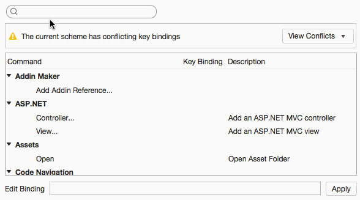

# Key bindings

Many commands can be activated from key bindings, which are shown beside the commands in the menus. Some commands are
not shown in the menus, and you can find these in the [Preferences/KeyBindings](#prefs) preferences panel, where you can also
change or add key bindings of your own.

