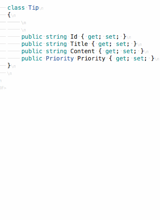

# Generate code

The [MonoDevelop.CodeGeneration.CodeGenerationCommands.ShowCodeGenerationWindow](#command) command can
automatically generate common code patterns. For example, it can generate a constructor to assign
arguments to properties:

After opening the code generation window, select a generator from the upper list with the arrow keys, then hit
[Tab](#key) to move to the lower list. Use [Space](#key) to select which items to include, then [Return](#key)
to generate the code.